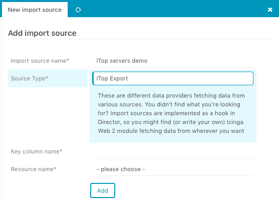
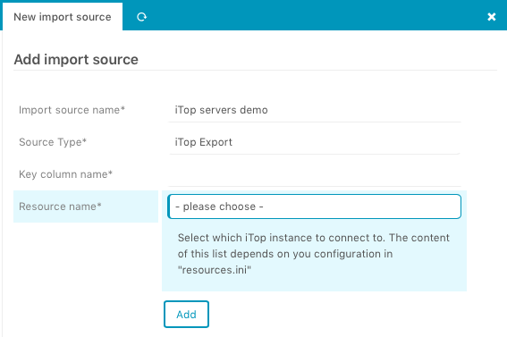
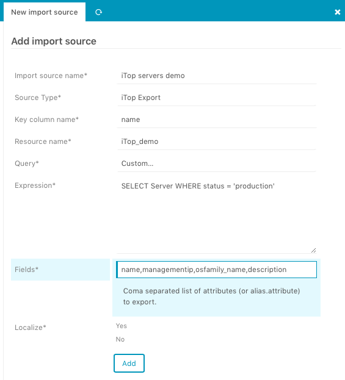

<a id="Import-source"></a>Use iTop exports as an Import source
==============================================================

Hint: This chapter assumes that you are already familiar with the [Icinga Director Import and Synchronization](https://github.com/Icinga/icingaweb2-module-director/blob/master/doc/70-Import-and-Sync.md) mechanism.

## Add a new Import source

Given that, the next steps should be fairly easy.
From the _Import source overview_, click _Add import source_ and choose the `iTop Export` option for _Source Type_:



## Select a iTop resource

With this selection, you specify from which iTop instance you want to export data from:



Initially, this list is empty.
You have to provide a iTop resource in the `resources.ini` file usually located at `/etc/icingaweb2/`.
There is currently no possibility to create such type of resource within the Icinga Web 2 interface.
This means that the only way to do it for the moment is by modifying the `resources.ini` file manually.
The iTop resource should look as follows:

```ini
[iTop_demo]
type = "iTop"
url = "http://demo.example.com/itop"
username = "user"
password = "pass"
```

## Provide query or expression

In order to specify which data you want to export from iTop and import into Icinga, you have 2 options.

### Select query from phrasebook

After you selected a iTop resource, the module retrieved a list of queries from the iTop [Query phrasebook](https://wiki.openitop.org/doku.php?id=2_3_0:admin:phrasebook) of the selected resource.
Select one of the available queries and that's it.

### Provide custom OQL query

If you select `Custom…` from the list of queries, you will be able to provide a custom OQL query.
Please see the [iTop documentation](https://wiki.openitop.org/doku.php?id=2_3_0:oql:start) on how to do that.
You will also need to provide the fields needed for the import/export:



## Localisation

Last step is to select whether or not translation of the iTop enum values and field names should occur.
This is mostly not the case, so selecting `no` for _Localize_ will usually be sufficient.
